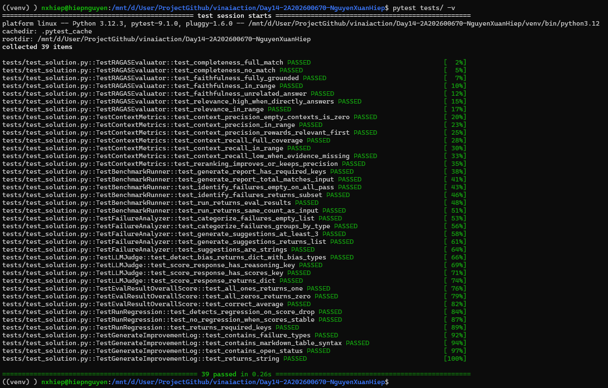

# Day 14 — Exercises
## AI Evaluation & Benchmarking | Lab Worksheet

**Lab Duration:** 3 hours

---

## Part 1 — Warm-up

### Exercise 1.1 — RAGAS Metric Thresholds

Theo bài giảng, score interpretation:
- 0.8–1.0: Good (Monitor, maintain)
- 0.6–0.8: Needs work (Analyze failures, iterate)
- < 0.6: Significant issues (Deep investigation)

Cho mỗi RAGAS metric, xác định khi nào score thấp là acceptable vs critical:

| Metric | Acceptable Low Score Scenario | Critical Low Score Scenario | Action Required |
|--------|------------------------------|-----------------------------|-----------------|
| **Faithfulness** | Câu hỏi không cần “facts từ context” (chit-chat/creative) hoặc context rỗng nhưng user không yêu cầu kiến thức cụ thể. | RAG factual/enterprise mà faithfulness thấp → có nguy cơ **hallucination** (bịa/sai) gây rủi ro cao. | Tăng chất lượng retrieval + prompt “chỉ trả lời dựa trên context”, bắt buộc cite/quote, “không có bằng chứng thì nói không biết”, guardrails chống bịa. |
| **Answer Relevancy** | User hỏi mơ hồ; agent trả lời theo hướng “gợi ý làm rõ” nên overlap thấp nhưng hợp lý. Hoặc agent từ chối đúng cho out-of-scope. | Trả lời **lạc đề**, không giải quyết câu hỏi → user thất bại nhiệm vụ. | Cải thiện intent detection, prompt trả lời “đúng trọng tâm”, query rewrite, thêm few-shot Q→A đúng ý. |
| **Context Recall** | Câu hỏi rất đơn giản, chỉ cần 1 mẩu evidence; recall thấp do token mismatch nhưng vẫn đủ ý. | Retriever **bỏ sót evidence** → generator phải đoán → dễ sai/thiếu. | Tăng top-k, hybrid search (BM25+vector), query expansion/multi-query, tuning chunk size/overlap, cải thiện embedding/index + metadata filter. |
| **Context Precision** | Bạn retrieve rộng để tăng recall (top-50) rồi có **rerank** lấy top-5; precision “trước rerank” có thể thấp nhưng chấp nhận. | Precision thấp mà **không rerank/filter** → context nhiễu, tốn token, model dễ bị distract → giảm faithfulness/relevance. | Reranking (cross-encoder), metadata filtering, MMR giảm trùng lặp, tuning query/chunking, giới hạn context sau rerank. |
| **Completeness** | User yêu cầu “trả lời ngắn/tóm tắt”, expected dài → completeness có thể thấp nhưng vẫn đạt mục tiêu UX. | Task yêu cầu checklist/quy trình đầy đủ mà thiếu ý → sai bước / không dùng được. | Prompt theo cấu trúc (bullet/checklist), yêu cầu “cover all key points”, tăng context window, retrieve thêm, self-check “đã đủ ý chưa?”. |

---

### Exercise 1.2 — Position Bias in LLM-as-Judge (MANUAL)

Từ bài giảng, 3 loại bias trong LLM-as-Judge:
- **Position Bias:** Judge ưu tiên answer xuất hiện trước
- **Verbosity Bias:** Judge cho điểm cao hơn answer dài hơn
- **Self-Preference:** GPT-4 judge ưu tiên GPT-4 output

**Câu 1: Thiết kế experiment phát hiện Position Bias (MANUAL)**
> Thiết kế A/B test với 2 conditions:
> - Condition A: đưa Answer_1 trước Answer_2
> - Condition B: đảo thứ tự, đưa Answer_2 trước Answer_1  
> Giữ nguyên nội dung 2 câu trả lời, randomize thứ tự nhiều lần trên nhiều câu hỏi. Nếu trung bình điểm của câu xuất hiện **đầu** cao hơn có ý nghĩa thống kê → có positional bias.

**Câu 2: Làm sao fix Verbosity Bias trong rubric design? (MANUAL)**
> - Chấm theo **tiêu chí nội dung** (đủ ý / đúng ý / grounded) thay vì “dài = tốt”.
> - Thêm rule trong rubric: “Không cộng điểm vì dài; chỉ cộng điểm nếu có thông tin cần thiết.”
> - Có thể đặt giới hạn: “Trả lời ≤ N câu” hoặc chuẩn hóa format (bullet checklist ngắn).

**Câu 3: Tại sao cần "calibrate against human" theo best practices? (MANUAL)**
> Vì LLM judge có bias và drift; calibrate với human giúp đảm bảo thang điểm của judge **khớp tiêu chuẩn thật**, phát hiện judge quá dễ/khó (leniency/severity), và đảm bảo metric phản ánh chất lượng người dùng cảm nhận.

---

### Exercise 1.3 — Evaluation trong CI/CD (MANUAL)

Theo bài giảng: "Agent không pass eval = không được deploy, giống unit test."

**Câu 1: Bạn sẽ set threshold nào cho từng metric trong CI/CD pipeline? (MANUAL)**

| Metric | Threshold (block deploy nếu dưới) | Lý do |
|--------|----------------------------------|-------|
| **Faithfulness** | **0.70** | Bài giảng nhấn mạnh faithfulness thấp là rủi ro lớn (hallucination). |
| **Answer Relevancy** | **0.60** | Relevance thấp → không giải quyết câu hỏi, giảm UX. |
| **Completeness** | **0.60** | Thiếu ý → trả lời không dùng được, đặc biệt với hướng dẫn/quy trình. |

**Câu 2: Khi nào nên chạy offline eval vs online eval? (MANUAL)**
> - **Offline eval**: trước mỗi merge/release, sau mỗi thay đổi prompt, trước demo/launch (quality gate).  
> - **Online eval**: monitoring sau deploy (log sampling + đánh giá định kỳ), phát hiện drift theo thời gian, phát hiện lỗi “theo traffic thật”.

---

## Part 2 — Core Coding

Verify code bằng unit tests:

```bash
pytest tests/ -v
```
